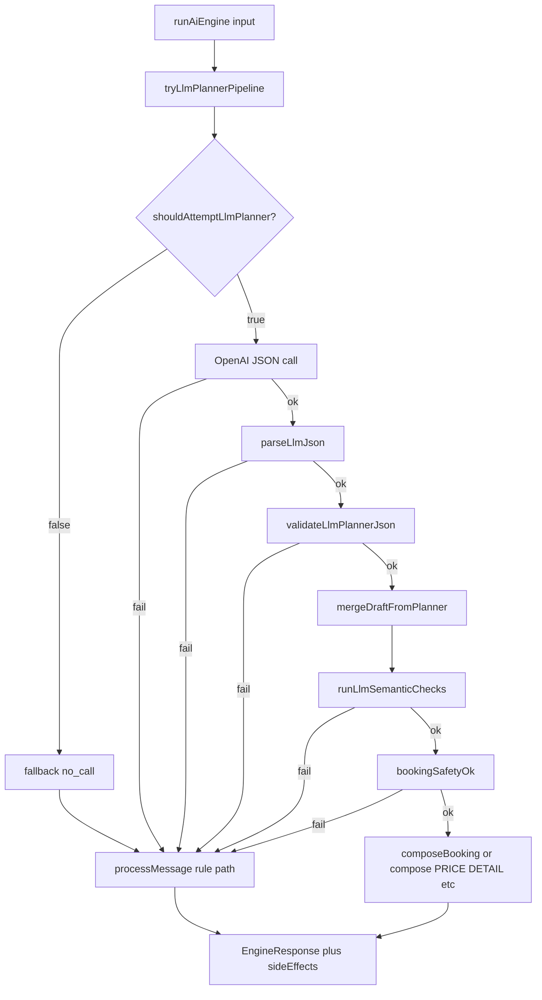

# AI engine — end-to-end process (rule + LLM planner)

This document describes **the full chat AI path** from API request to reply and side effects: configuration, `runAiEngine`, LLM planner attempts, every fallback, semantic gates, composers, persistence, and **temporary debug logging** (`[LLM-PIPELINE]`).

For v1 product rules and constraints, see also [`ai-engine-llm.md`](./ai-engine-llm.md).

---

## 1. Where it runs

| Layer | Location |
|-------|----------|
| HTTP entry | `POST /api/chat/message` → [`apps/api/src/modules/chat/chat.service.ts`](../apps/api/src/modules/chat/chat.service.ts) |
| Engine entry | [`runAiEngine()`](../packages/ai-engine/src/orchestrator.ts) in `@ats/ai-engine` |
| LLM branch | [`tryLlmPlannerPipeline()`](../packages/ai-engine/src/llm-pipeline.ts) |
| Rule branch | [`processMessage()`](../packages/ai-engine/src/orchestrator.ts) (deterministic) |
| Persistence / side effects | [`chat-persistence.service.ts`](../apps/api/src/modules/chat/chat-persistence.service.ts) (unchanged by LLM flag) |

---

## 2. Configuration process

1. Read **`AI_ENGINE_MODE`**. If unset, code resolves to **`auto`** (`resolveAiEngineMode()` in `llm-config.ts`).
2. If mode is **`rule`** → LLM planner is **not** attempted (`shouldAttemptLlmPlanner()` = false).
3. If mode is **`llm`** or **`auto`** → planner is attempted **only if** **`OPENAI_API_KEY`** is non-empty after trim.
4. Optional: **`OPENAI_DEFAULT_MODEL`** (default `gpt-4o-mini`), **`AI_ENGINE_LLM_TIMEOUT_MS`** (default `15000`).

**Important:** With default **`auto`** + a valid key, the LLM path runs. Set **`AI_ENGINE_MODE=rule`** to disable OpenAI entirely (e.g. staging without keys).

---

## 3. High-level flow (`runAiEngine`)



---

## 4. LLM planner pipeline (ordered steps)

When `shouldAttemptLlmPlanner()` is **true**:

| Step | What happens | On failure → return `null` (rule fallback) |
|------|----------------|-----------------------------------------------|
| A | Build prompt: catalog summary, booking draft JSON, recent messages, latest user text | — |
| B | **`callOpenAiPlannerJson`** — Chat Completions, `response_format: json_object` | OpenAI error or `empty_content` |
| C | **`parseLlmJson`** — extract `{...}` from response string | `parseLlmJson_failed` |
| D | **`validateLlmPlannerJson`** — schema v1, enums, types, extracted shape | `validateLlmPlannerJson_failed` + **reason** |
| E | **`mergeDraftFromPlanner`** — merge LLM `extracted` + `serviceMention` with **`extractSlots`** (deterministic wins conflicts) | — |
| F | **`runLlmSemanticChecks`** — see §5 | `semantic_check_failed` + **reason** |
| G | **`bookingSafetyOk`** — if draft complete, `buildBookingDateTime` must not throw | `bookingSafetyOk_failed` |
| H | Choose **composer**: booking vs non-booking (see §6) | — |

If any step returns `null`, **`runAiEngine`** uses **`processMessage(input)`** (full rule path). **Replies can look identical** to rule-only mode because v1 **always** uses the same **template composers** for final wording.

---

## 5. Semantic cross-check reasons (`semantic_check_failed`)

After JSON validation, **`runLlmSemanticChecks`** may fail with:

| Reason | Meaning |
|--------|---------|
| `intent_rule_mismatch` | Planner `intent` incompatible with **`resolveRepairedRuleIntent`** (same repair chain as rule orchestrator). |
| `mention_unresolved` | `serviceMention` length ≥ 2 but catalog **`matchService`** → `none` for PRICE / DETAIL / BOOKING. |
| `mention_service_mismatch` | Resolved service does not **align** with `serviceMention` (display name / alias overlap check). |
| `slot_fill_without_draft` | Planner `BOOKING_SLOT_FILL` but no prior draft progress. |
| `non_booking_date_leak` | Non-booking intent but merged **date** appeared without message `extractSlots` or prior draft date. |
| `non_booking_time_leak` | Same for **time**. |
| `booking_datetime_in_non_booking_planner` | Non-booking intent (except `CONTACT_INFO`) but planner JSON has **both** `extracted.date` and `extracted.time`. |

Any of these → **silent fallback** to rule unless you use debug logs (§8).

---

## 6. Composer selection (success path)

- **Booking composer** (`composeBookingResponse`) when:
  - Planner intent is **`BOOKING`** or **`BOOKING_SLOT_FILL`**, **or**
  - Merged draft has progress and intent is not strong non-booking (PRICE/DETAIL/INQUIRY), not GREETING, and **`OTHER`** matches slot-follow — **or** **`CONTACT_INFO`** only when **`isActiveBookingFlow`**: draft has **service** and (**date** or **time** or booking-class planner intent), so name/phone alone does not wrongly open booking slot questions.
- **PRICE:** when draft fallback is allowed and match is `none` but draft has **`serviceName`**, resolve service from **catalog by code** for pricing (see `llm-pipeline.ts`).
- Otherwise by planner intent: **DETAIL** → `composeDetailResponse`, **PRICE** → `composePriceResponse`, **INQUIRY** → `composeInquiryResponse`, **GREETING** → `composeGreeting`, **CONTACT_INFO** → `composeContactInfoResponse`, else **`composeFallback`**.

**v1:** Customer-visible **`reply`** always comes from these composers, **not** from LLM `replyText`.

---

## 7. Rule path (`processMessage`) — summary

If LLM returns `null`:

1. Fold message; **`detectIntent`** + same **repairs** as `resolveRepairedRuleIntent` (DETAIL / PRICE / slot-follow).
2. **`extractSlots`**, **`extractServiceText`**, **`matchService`**, merge into draft.
3. Route to the same **`compose*`** family as above.
4. **`collectSideEffects`** in `runAiEngine` from final `EngineResponse` (unchanged contract).

---

## 8. Temporary debug logging (Task 13B)

**Prefix:** `[LLM-PIPELINE]` — grep-friendly.

| Log | When |
|-----|------|
| `shouldAttemptLlmPlanner={true\|false} mode=... OPENAI_API_KEY_set={true\|false}` | Start of every `tryLlmPlannerPipeline` call |
| `fallback=no_call` | Mode/rule or missing key — planner not attempted |
| `fallback=empty_content` / `fallback=openai_call_failed` | OpenAI layer; `detail=` JSON string of error |
| `fallback=parseLlmJson_failed` | Non-parseable JSON object in response |
| `fallback=validateLlmPlannerJson_failed reason=...` | Schema validation |
| `fallback=semantic_check_failed reason=...` | §5 |
| `fallback=bookingSafetyOk_failed` | Invalid complete booking datetime |
| `success intent=... composer=booking\|price\|detail|...` | LLM path completed |
| `runAiEngine source=llm_pipeline\|rule_fallback conv=...` | After pipeline in [`orchestrator.ts`](../packages/ai-engine/src/orchestrator.ts) |

**Example — “looks like rule” but key + `llm` set:**

```text
[LLM-PIPELINE] shouldAttemptLlmPlanner=true mode=llm OPENAI_API_KEY_set=true
[LLM-PIPELINE] fallback=semantic_check_failed reason=intent_rule_mismatch
[LLM-PIPELINE] runAiEngine source=rule_fallback conv=550e8400…
```

**Remove later:** comments marked `TEMP DEBUG (Task 13B)` in `llm-pipeline.ts` and `orchestrator.ts`.

---

## 9. API / persistence process

1. Resolve/create contact and conversation; append customer message.
2. Load **booking draft** from last `AiRun.signals`.
3. Retrieve **knowledge** chunks for tenant.
4. Build **`AiEngineInput`** (includes recent messages).
5. **`await runAiEngine(aiInput)`** — LLM or rule as above. **`chat.service`** wraps this in **try/catch**: on throw (e.g. unexpected engine error), logs and returns a **fixed fallback Cantonese reply** so the customer still gets a message; side effects are skipped for that turn.
6. **`executeSideEffects`** (CREATE_BOOKING, UPDATE_CONTACT) — deterministic; LLM does not write DB.
7. Append AI message; **`saveAiRun`** with signals, side effects, failures.

---

## 10. Verification commands (package `ai-engine`)

```bash
cd packages/ai-engine
pnpm build
pnpm test:regression
```

Runs: LLM JSON validation regression, merge regression, **semantic** regression, plus existing rule regressions (orchestrator, intent, booking-state, etc.).

---

## 11. Document index

| Doc | Purpose |
|-----|---------|
| [`ai-engine-llm.md`](./ai-engine-llm.md) | v1 constraints, env, architecture summary |
| **This file** | Full process, fallbacks, logging, flow |
| [`internal-pilot-readiness.md`](./internal-pilot-readiness.md) | Pilot env notes including `AI_ENGINE_MODE` |
| [`known-limitations.md`](./known-limitations.md) | Product caveats including modes |
